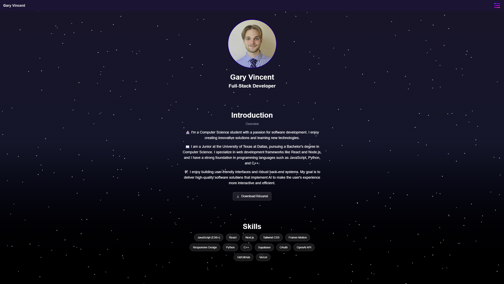
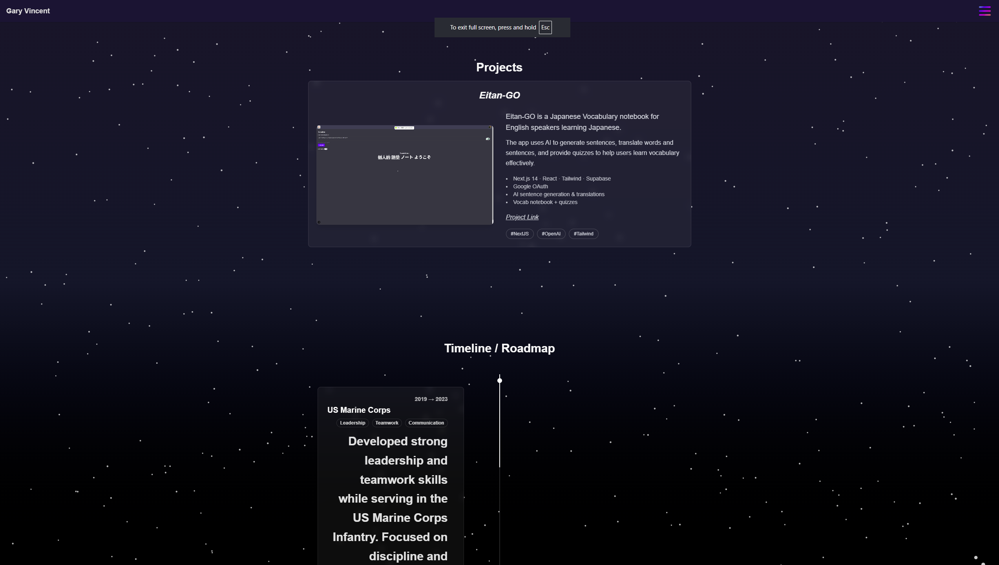
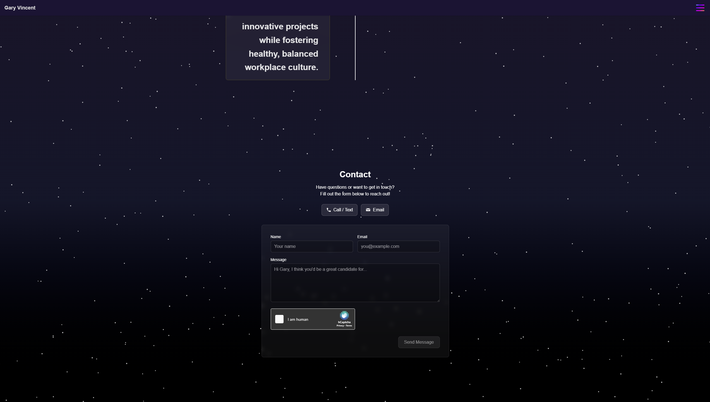

# Gary Vincent | Portfolio Website

🌐 **Live Demo:** [https://garyvincent.dev](https://garyvincent.dev)

---

## 📖 About
A personal portfolio website built with **Next.js 15**, **Tailwind CSS**, and **Vercel**.  
It showcases my projects, skills, and career roadmap with a responsive, animated design.

---

## ✨ Features
- Smooth scroll animations with **Framer Motion**
- Responsive design with **Tailwind CSS**
- Particle background for depth
- Timeline & Skills sections for recruiters
- Contact form with **hCaptcha** + **Resend** email delivery
- Deployed at **garyvincent.dev**

---

## 🛠 Tech Stack
- **Frontend:** Next.js (App Router), React, Tailwind CSS, Framer Motion  
- **Backend / APIs:** Next.js API Routes, Resend (email), hCaptcha  
- **Deployment:** Vercel  

---

## 📸 Screenshots

### Hero Section

### Projects Section

### Contact Section

---

## 📬 Contact
- **Portfolio:** [https://garyvincent.dev](https://garyvincent.dev)
- **LinkedIn:** [https://www.linkedin.com/in/gary-vincent-ab1542290/](https://www.linkedin.com/in/gary-vincent-ab1542290/)
- **Email:** gtvincent2000@gmail.com
